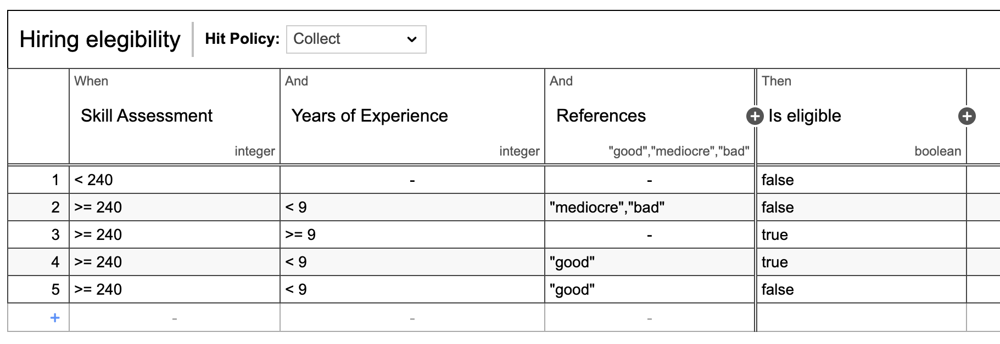

# Formal Argumentation Dialogues and Business Decision Management
This programming tutorial illustrates how to integrate formal argumentation-based dialogues and business decision
management approaches (using Camunda's [DMN execution engine](https://docs.camunda.org/manual/7.4/user-guide/dmn-engine/embed/)):
In our example, we start with an ambiguous decision result that a Decision Model and Notation (DMN) decision
  table returns, and that is then enriched with human-provided arguments until a final decision is reached.

Let us assume we want to determine the hiring *eligibility* of an applicant for a software engineering position, *i.e.*,
we are only looking at the part of the early screening process that determines whether an offer can potentially be made
according to organizational rules and guidelines. A part of the eligibility assessment is automated as a DMN decision
table.



However, the decision table may not yield (indicated by the *collect* [Hit Policy](https://methodandstyle.com/dmn-whats-hit-policy/)).
If the applicant does not have a lot of experience, but fulfills the requirements, otherwise, the hiring manager may
request to label the applicant as eligible. Let us execute such an 'edge case'.


First, we set up the DMN decision engine.
```java
DmnEngineConfiguration configuration = DmnEngineConfiguration.createDefaultDmnEngineConfiguration();
DmnEngine dmnEngine = configuration.buildEngine();
```
We load the decision into the engine.

```java
DmnDecision decision;
File initialFile = new File("./src/main/resources/examples/admission-eligibility-decision.dmn11.xml");
```

Now, we can run our case. We assume an applicant with good references, 8 years of experience, and a score of 240 on the
eligibility test. Note that the code needs to be wrapped into a try-catch clause.

```java
System.out.println("Determine eligibility of candidate, Lead Software Engineer: good references, 8 years of experience, 240 score on ability test");
InputStream inputStream = new FileInputStream(initialFile);
decision = dmnEngine.parseDecision("decision", inputStream);
VariableMap variables = Variables
        .putValue("experienceYears", 8)
        .putValue("totalScore", 240)
        .putValue("references", "good");

DmnDecisionTableResult results = dmnEngine.evaluateDecisionTable(decision, variables);
System.out.println("DMN decision results: " + results.toString());
```

Construct argumentation framework if  the results that are returned are ambiguous, and we assume we do not have
preferences between results, *i.e.* we construct mutual attacks between all arguments.
```java
if(results.size() > 1) { // if results are indecisive, construct argumentation framework
    DungTheory argFramework = new DungTheory();
    ArrayList<Attack> attacks = new ArrayList<>();
    for (DmnDecisionRuleResult result : results) {
        String argumentKey = result.keySet().iterator().next();
        Boolean argumentValue = result.getFirstEntry();
        String argumentName = argumentKey + ": " + argumentValue;
        Argument argument = new Argument(argumentName);
        argFramework.add(argument);
        for (DmnDecisionRuleResult otherResult : results) {
            String otherArgumentKey = otherResult.keySet().iterator().next();
            Boolean otherArgumentValue = otherResult.getFirstEntry();
            if(argumentKey.equals(otherArgumentKey) && argumentValue != otherArgumentValue) {
                String otherArgumentName = otherArgumentKey + ": " + otherArgumentValue;
                Argument otherArgument = new Argument(otherArgumentName);
                attacks.add(new Attack(argument, otherArgument));
            }
        }
    }
    argFramework.addAllAttacks(attacks);
    System.out.println("Initial argumentation framework: \n" + argFramework.prettyPrint());
    // Note that we continue in this 'if'-clause
}
```

Assuming preferred semantics, we get more than one extension from the argumentation framework.
```java
 System.out.println("No conclusion, yet: \n" + preferredSemantics.getModels(argFramework));
```

In our case, we need a human who breaks the tie. This might be the hiring manager. Here, we assume a front-end that
instructs our reasoner to build the argumentation framework expansion that we hard-code below. In the real world, we
would need to have proper lookup and generation functions for arguments, but we simplify here. Let us highlight that we
create a new *expansion* to keep track of history, *i.e.* once we have drawn an inference, we consider an argumentation
framework immutable.

```java
Argument managerArgument = new Argument("Position to be filled");
Attack managerAttack = new Attack(managerArgument, new Argument("IsEligible: false"));
DungTheory managerExpansion = new DungTheory();
managerExpansion.add(argFramework);
managerExpansion.add(managerArgument);
managerExpansion.add(managerAttack);
```

Now, we can infer a clear conclusion; the candidate can be considered eligble.

```java
System.out.println("First expansion: \n" + managerExpansion.prettyPrint());
System.out.println("According to the manager, we can move on with the candidate: \n" + preferredSemantics.getModels(managerExpansion));
```

However, HR needs to approve the case and finds out it violates diversity requirements (another, more 'diverse'
candidate is formally equally or better qualified).

```java
DungTheory hrExpansion = new DungTheory();
Argument hrArgument = new Argument("Diversity requirements not satisfied");
Attack hrAttack1 = new Attack(hrArgument, managerArgument);
Attack hrAttack2 = new Attack(hrArgument, new Argument("IsEligible: true"));
hrExpansion.add(managerExpansion);
hrExpansion.add(hrArgument);
hrExpansion.add(hrAttack1);
hrExpansion.add(hrAttack2);
System.out.println("Second expansion: \n" + hrExpansion.prettyPrint());
System.out.println("According to HR, the candidate is not eligible: \n" + preferredSemantics.getModels(hrExpansion));
```

Although this example is very simple, it already hints at some useful insights we can gain from using formal
argumentation approaches for introducing a first-class abstractions for conflicts. For example, when annotating and
storing the argumentation frameworks that underlie our instances of our *eligibility check* process (and other processes).
we can answer the following questions:

* How often is a machine 'decision' indecisive? A high number of cases is an indicator of automation potential.

* How often is machine decision 'overruled' by a human / another machine? A high number of cases is an indicator that
  the automated decision rules should be updated.

* How often is a human decision 'overruled' by another human? A high number of cases is an indicator of
  socio-organizational misalignment (culture problems).

The XML of the DMN decision diagram is available [here](./src/main/resources/examples/admission-eligibility-decision.dmn11.xml).
It can be edited with different editors for example [this one](https://editor.signavio.com/) or [that one](https://camunda.com/download/modeler/).
However, there are typically some  interoperability issues between DMN editors and DMN engines, even when editor and
engine are provided by the same vendor.  The full Java code is available [here](./src/main/java/examples/FormalDialoguesSimple.java).
To run the example, execute `./gradlew run dialogueExampleSimple` in the git project's `examples` directory.
